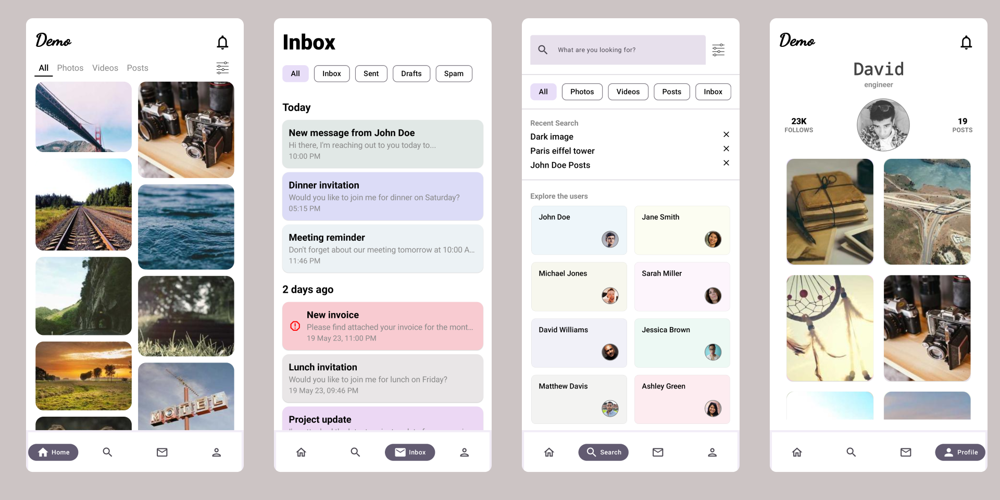
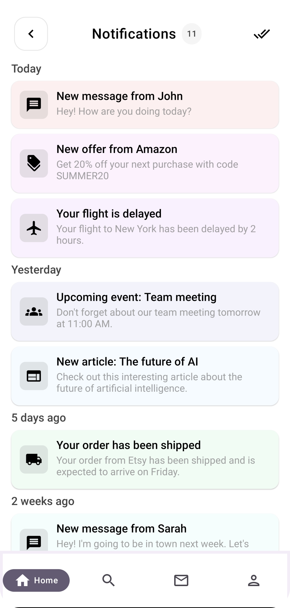

# Introduction

Welcome to my Jetpack Compose journey! As a newcomer to Jetpack Compose, I'm excited to learn and grow in this modern UI toolkit for Android development. Throughout my exploration, I may encounter errors, and part of the learning process involves resolving them.🚀

## Objective

This repository serves learning experiences with Jetpack Compose. If you come across any errors in my code or documentation, I would greatly appreciate your assistance in resolving them. By collaboratively addressing issues, we can enhance the quality of this repository and contribute to the broader Jetpack Compose community.🛠️

## Design Cover

## Screenshots

 

## Authors

- Sanket Jain

